## DormManager – Android Mobile App

This is the **Android mobile application** (Java, MVVM) for the **dormitory management system**. It is designed mainly for residents to manage their everyday dormitory life from a phone, and to interact with the same backend used by the admin panel.

### What users can do

- **Authenticate** (login / register, manage profile)
- **View announcements** about dormitory life
- **Create and track issues** (e.g. maintenance tickets)
- **Browse and manage reservations** of shared resources
- **View and manage payments**
- **Send and read messages**
- **Work with keys / access information** where supported

### Tech stack

- **Android Studio project**
- **Language**: Java
- **Architecture**: MVVM with ViewModel & LiveData
- **Networking**: Retrofit + OkHttp
- **JSON**: Gson
- **UI**: AppCompat, Material Components, RecyclerView, ConstraintLayout

### Requirements

- **Android Studio** (latest stable)
- **Android SDK**: `compileSdk = 36`, `targetSdk = 36`
- **Minimum Android version**: API 24 (Android 7.0)

### How to run

1. Open the `DormManager` folder in **Android Studio**.
2. Let Gradle sync finish.
3. Connect an Android device or start an emulator.
4. Select the **`app`** configuration.
5. Click **Run** ▶ to install and start the app.

Make sure your backend/API is running and reachable (same URLs as configured in the app’s Retrofit service classes).

### Screenshots

<table>
  <tr>
    <td>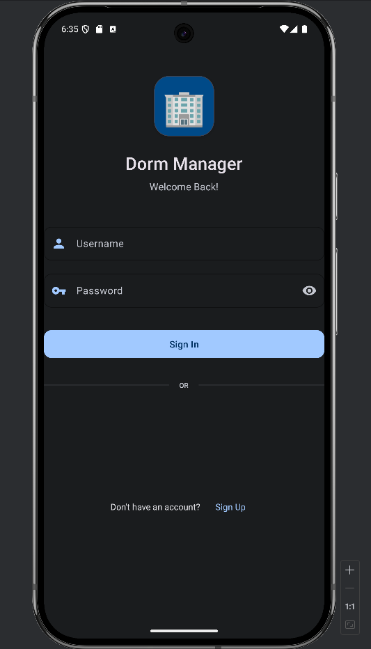</td>
    <td>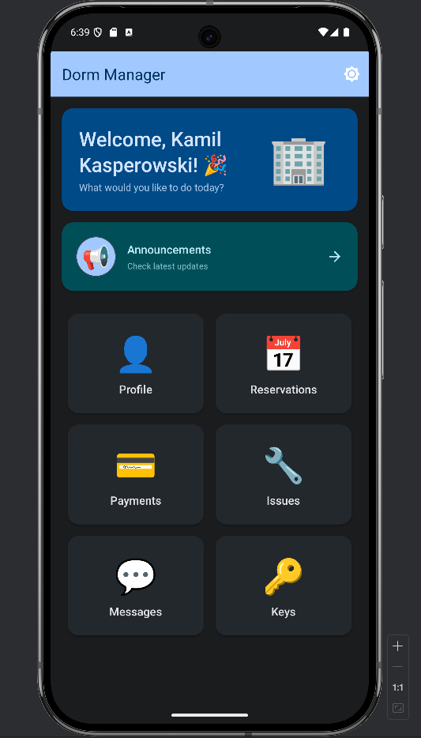</td>
  </tr>
  <tr>
    <td>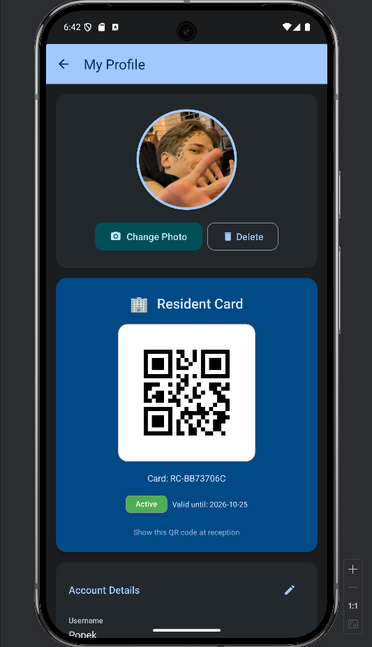</td>
    <td>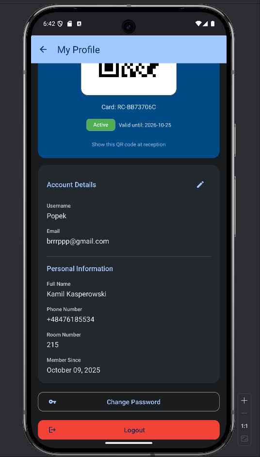</td>
  </tr>
  <tr>
    <td>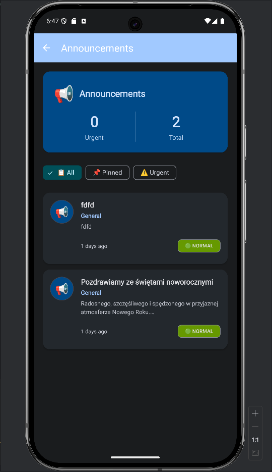</td>
    <td>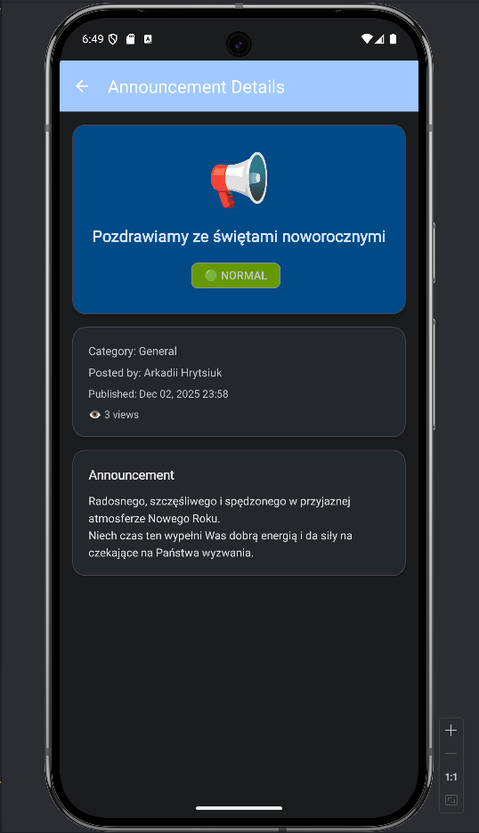</td>
  </tr>
  <tr>
    <td>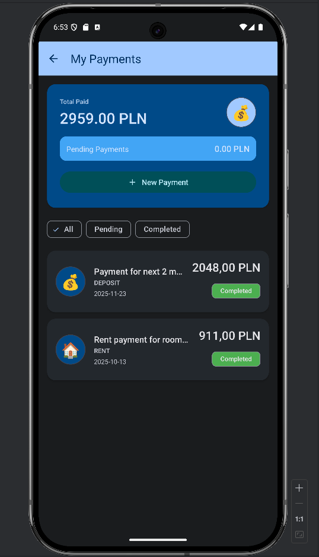</td>
    <td>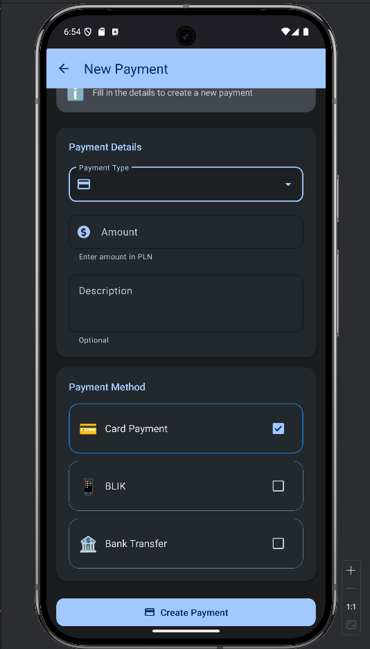</td>
  </tr>
  <tr>
    <td>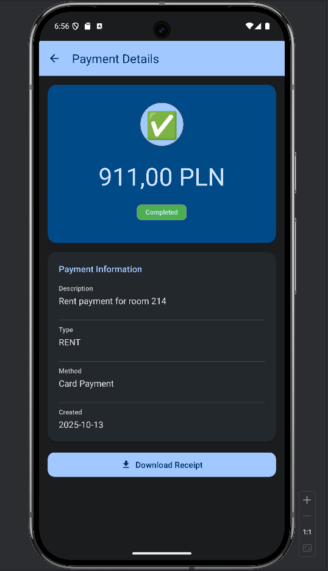</td>
    <td>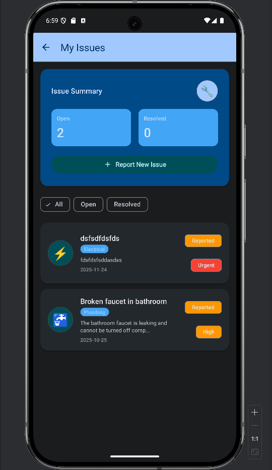</td>
  </tr>
  <tr>
    <td>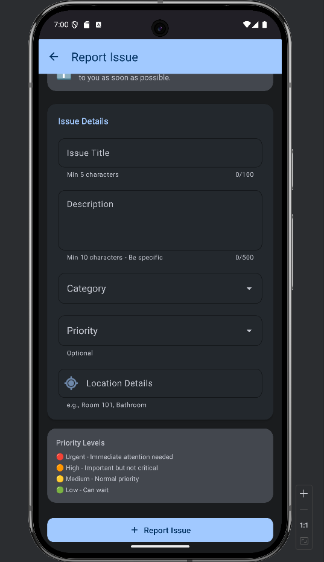</td>
    <td>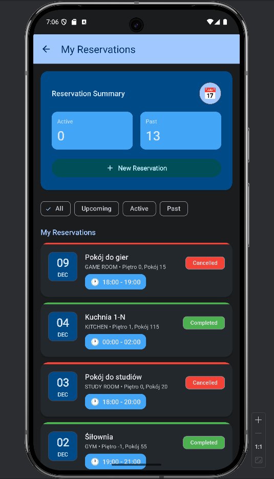</td>
  </tr>
  <tr>
    <td>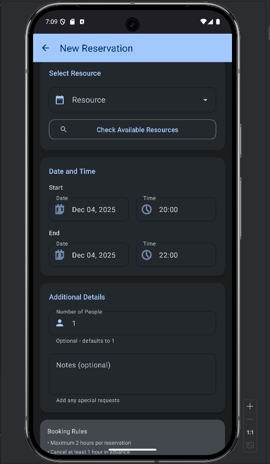</td>
    <td>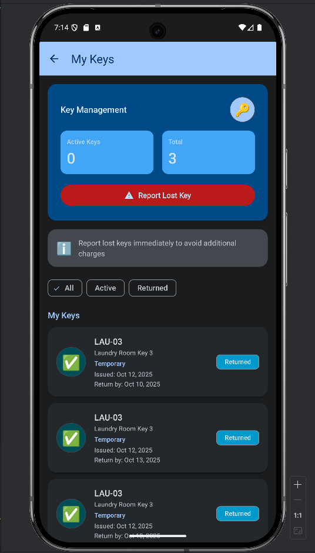</td>
  </tr>
  <tr>
    <td>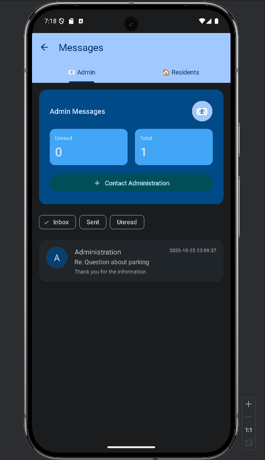</td>
    <td>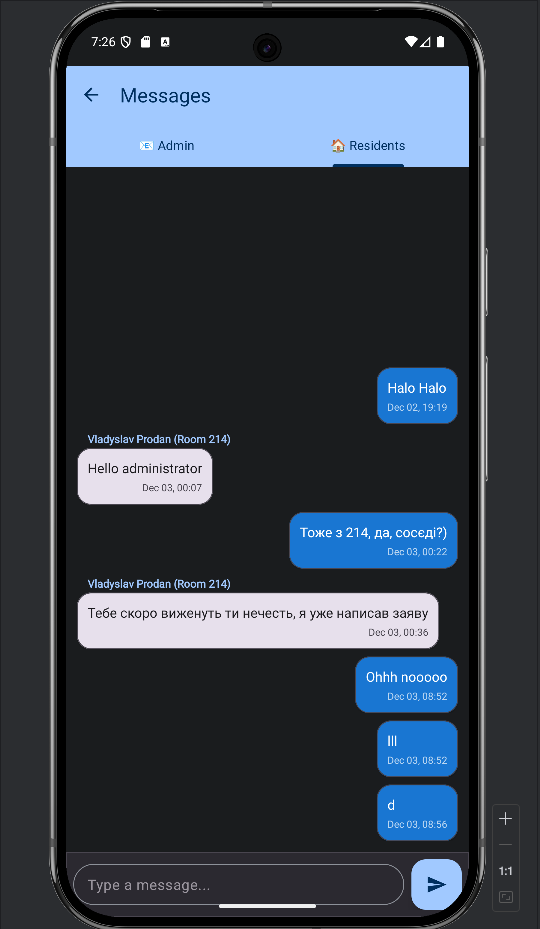</td>
  </tr>
</table>
